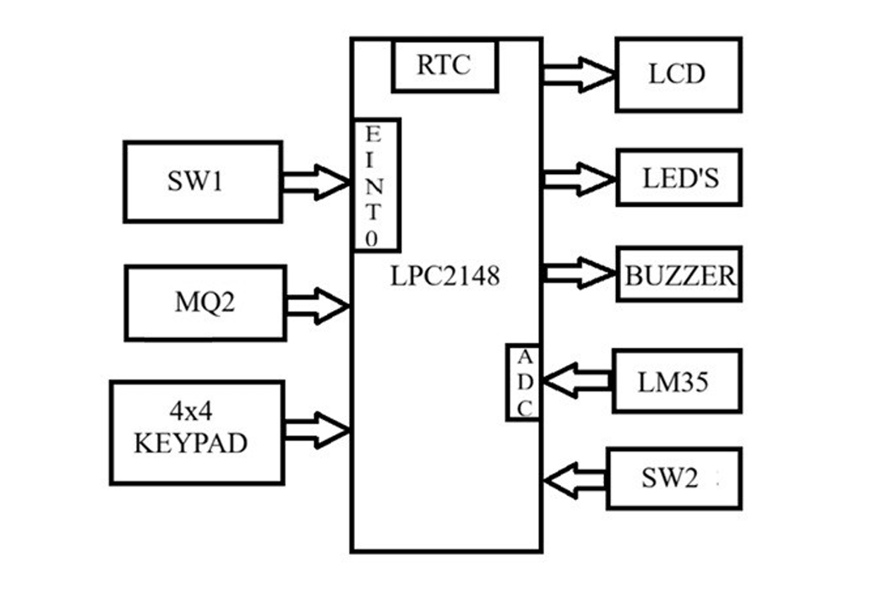
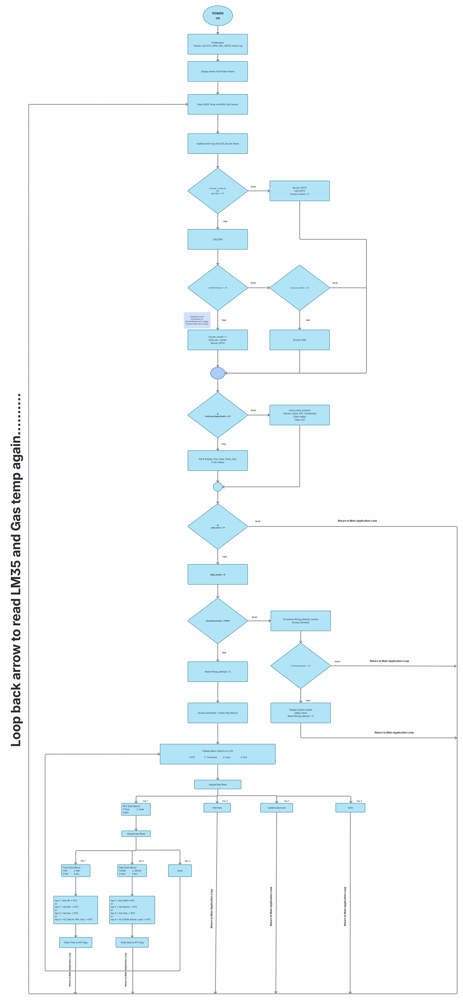

# Kitchen Safety Heat and Gas Monitoring System

## Project Overview

The Kitchen Safety Heat and Gas Monitoring System is an embedded safety application developed for the NXP LPC2148 ARM7TDMI-S microcontroller.
The system continuously samples ambient temperature via an analog LM35 sensor (10-bit ADC CH1) and monitors combustible gas concentration using an MQ2 sensor.

## Features

- Temperature monitoring using LM35
- Gas leakage detection using MQ2
- 16x2 LCD display
- RTC-based date and time
- Buzzer and LED alert
- Safety event recording
- Periodic display of the latest safety event
- Password-protected edit mode
- Temperature threshold editing
- RTC time/date editing
- Password change option
- Keypad-based menu

## Hardware Requirements

- LPC2148
- 16x2 LCD
- 4x4 Matrix Keypad
- LM35
- MQ2
- Buzzer
- LEDs
- Switches
- USB-UART / DB-9 cable

## Software Requirements

- Embedded C
- Keil µVision
- Flash Magic
- Proteus (for simulation/testing)

## System Block Diagram



## Flowchart



## Project Workflow

1. Initialize LPC2148 peripherals.
2. Initialize LCD, ADC, RTC, keypad and alert devices.
3. Read temperature from LM35.
4. Read gas level from MQ2.
5. Display sensor values and RTC information.
6. Compare sensor values with configured thresholds.
7. Generate an alert when an unsafe condition is detected.
8. Store the latest safety event with RTC timestamp.
9. Periodically display the latest event.
10. Allow secure parameter editing through Switch1 and keypad.
11. Return to normal monitoring mode.

## Security / Edit Mode

Switch1 enters the secure edit mode.

The user must enter the correct password before modifying system parameters.

Available options include:

- Edit RTC
- Edit temperature threshold
- Change password
- Exit

After three incorrect password attempts, the system enters a temporary
lock condition.

## Project Structure

```text
Kitchen_Safety_Heat_and_Gas_Monitoring_System/
│
├── header_file/
│ ├── LCD.h
│ ├── ADC.h
│ ├── RTC.h
│ └── ...
│
├── source_file/
│ ├── main.c
│ ├── LCD.c
│ ├── ADC.c
│ ├── RTC.c
│ └── ...
│
├── images/
│ ├── block_diagram.png
│ ├── pin_diagram.png
│ ├── flowchart.png
│ └── ...
│
├── simulation/
│
│
└── README.md
```
# Author
Bhanu prakash
